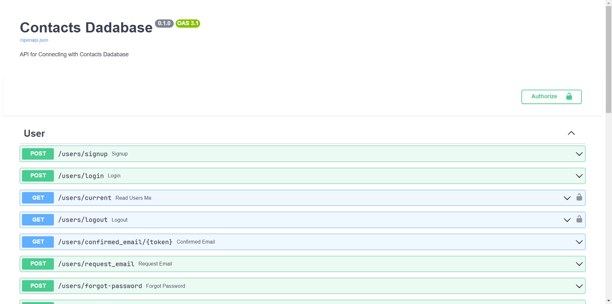
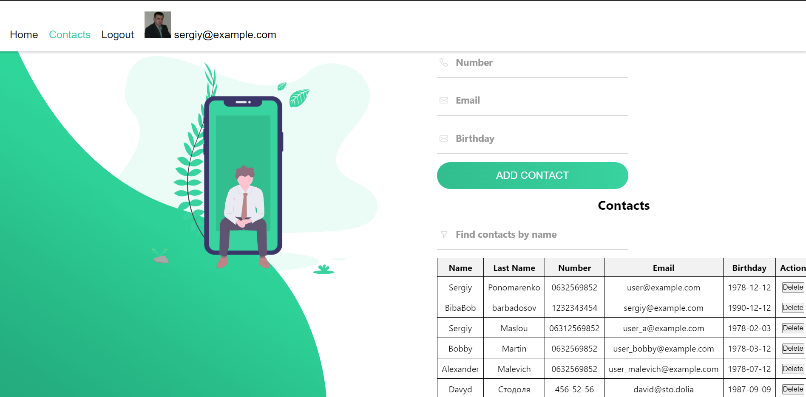

# Домашнє завдання #12-13

Створення REST API для зберігання та управління контактами за допомогою FastAPI та використовувати SQLAlchemy для управління базою даних.

## Вигляд проекту



## Клієнтська частина



## Установка проекту

Для управління залежностями проекту використовується `pipenv`. Необхідно встановити `pipenv` перед виконанням наступних кроків:

- Склонируйте репозиторий:

  ```shell
  git clone https://github.com/sergiokapone/goit_python_web_hw12.git
  ```

- Для встановлення залежностей використайте команду `pipenv install` або `pipenv sync`.

## Структура проєкту

```shell
src
├── database/
│   ├── config.ini
│   ├── connect.py
│   └── models.py
├── repository/
│   ├── contacts.py
│   └── users.py
├── routes/
│   ├── auth_routs.py
│   └── contacts_routs.py
├── services/
│   └── auth.py
├── utils/
│   ├── __init__.py
│   └── fake_contacts_create.py
├── app.py
├── main.py
└── schemas.py
```

## Запуск сервера

Для запуску сервера введіть в віртуальному оточенні команду

```shell
runserver
```

або

```shell
pipenv run python src/main.py
```

Після успішного запуску сервера, встановиться зв'язок з базою даник.

## Використанні API

Дані зберігаються у хмарній базі даних [ElephantSQL](https://www.elephantsql.com/).

API додатку надає можливість виконувати наступні операції з контактами:

## Сервер online

Сервер також доступний за адресою [https://fastapi12.onrender.com/](https://fastapi12.onrender.com/docs)
